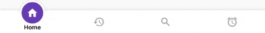
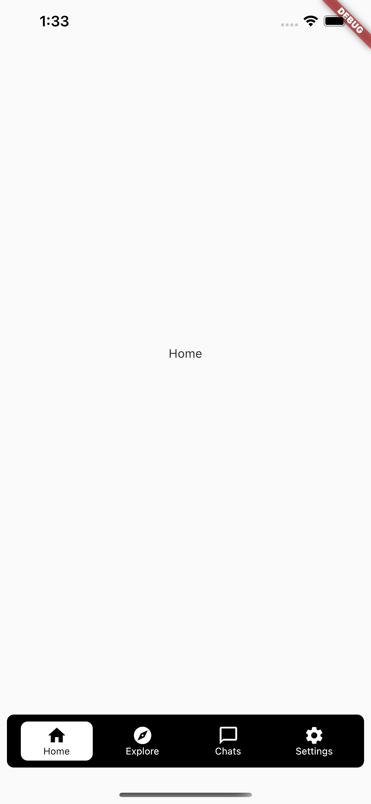

<!-- Write app name here  -->
# Bottom Navigation Bar With Five Package - Flutter

<!-- Just  label image -->
[][youtube]
[][twitter]

<!--  Star , fork and follow -->

 

<!-- description  -->
in this video tutorial we will explain how to use bottom navigation bar widget in flutter framework and how to use 5 package with it .

### ⚡&ensp;Social Media

<!-- facebook page  -->
&ensp;Facebook: [PesaCoder](https://facebook.com/PesaCoder "Facebook Pesa Coder")

<!--  Medium  -->
&ensp;Medium: [@PesaCoder](https://medium.com/@PesaCoder "Medium Pesa Coder")

<!--  twitter  -->
&ensp;Twitter: [@PesaCoder](https://twitter.com/intent/follow?original_referer=https%3A%2F%2Fgithub.com%2FPesaCoder&screen_name=PesaCoder "Twitter PesaCoder")

<!-- Linkedin -->
&ensp;Linkedin: [@PesaCoder](https://linkedin.com/in/PesaCoder "Linkedin Pesa Coder")

<!-- facebook profile  -->
&ensp;Facebook: [Usama Elgendy](https://facebook.com/usama.gindy "Facebook Usama Elgendy")

 ### ✌&ensp;Preview

## App Preview             
 

 

 

 

 
